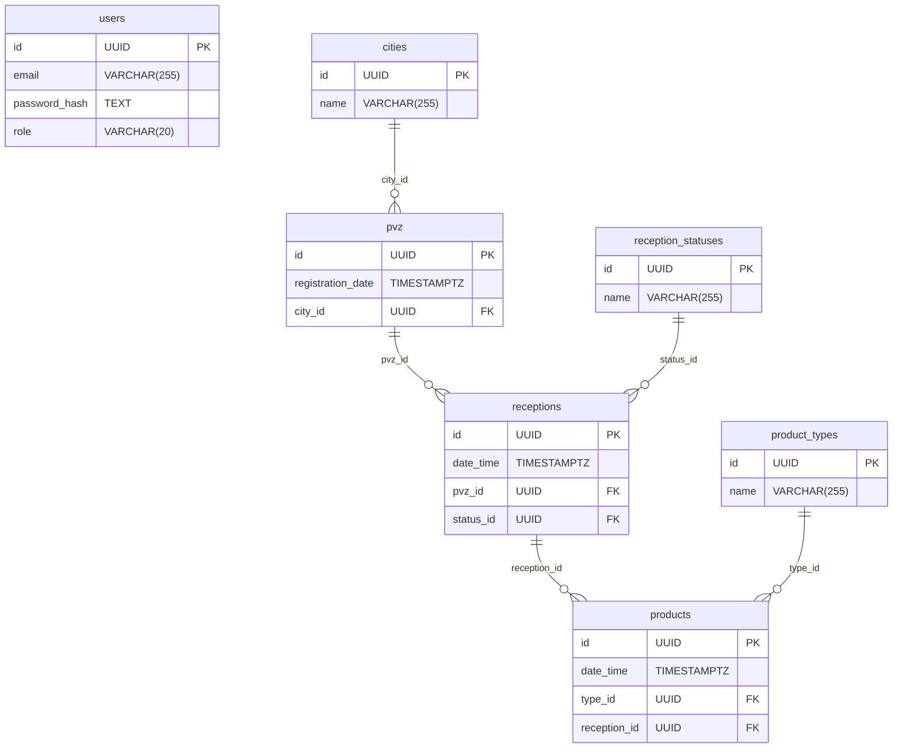

[](https://go.dev/)

[](https://codecov.io/github/valeragav/avito-pvz-service)

# avito-pvz-service

Решение тестового задания для стажировки в Авито.

[Описание задания](https://github.com/avito-tech/tech-internship/blob/main/Tech%20Internships/Backend/Backend-trainee-assignment-spring-2025/Backend-trainee-assignment-spring-2025.md)

## Сервисы

| Сервис             | URL                            |
| ------------------ | ------------------------------ |
| REST API           | http://localhost:8080          |
| Swagger            | http://localhost:8081/swagger/ |
| Prometheus metrics | http://localhost:9091/metrics  |
| Prometheus UI      | http://localhost:9090/query    |
| Grafana            | http://localhost:3030          |

## Быстрый старт

```bash
docker compose up

make fast-start
```

## Команды

```bash
make help        # список всех команд
make build       # сборка бинарника
make test        # запуск тестов
make coverage    # запуск тестов + отчёт о покрытии
make lint        # запуск линтера
make swagger-init # генерация swagger документации
make bin-deps    # установка зависимостей
```


## Таблицы

