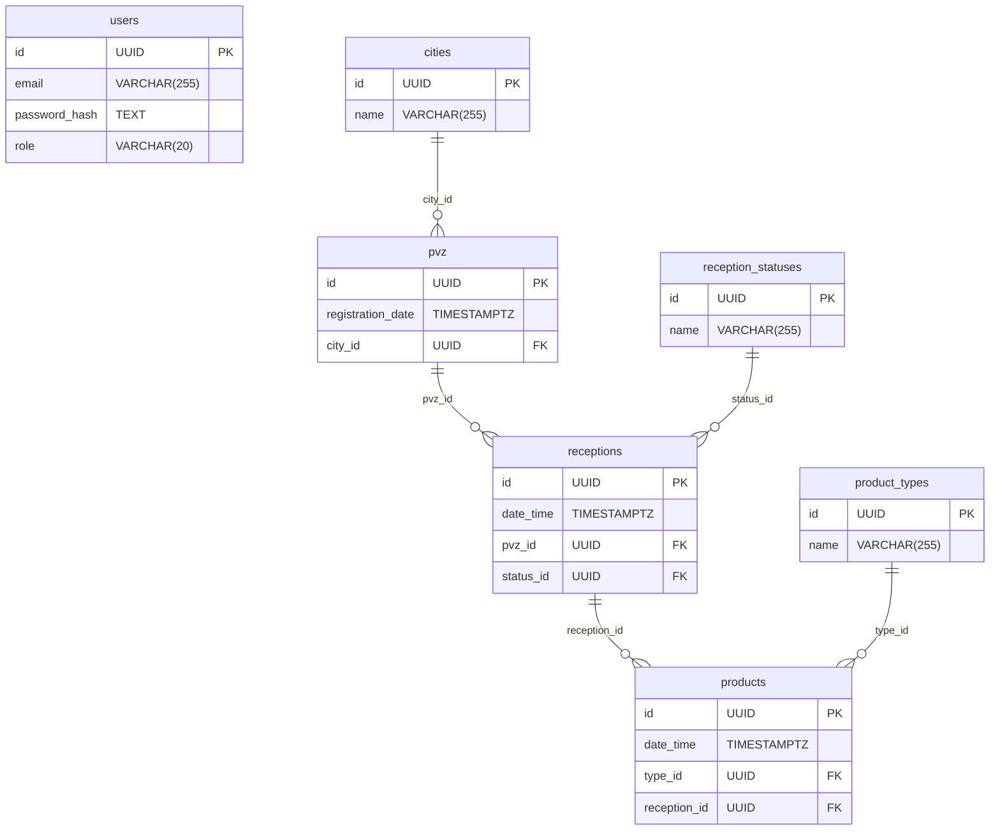

[](https://go.dev/)

[](https://codecov.io/github/valeragav/avito-pvz-service)

# avito-pvz-service

Решение тестового задания для стажировки в Авито.

[Описание задания](https://github.com/avito-tech/tech-internship/blob/main/Tech%20Internships/Backend/Backend-trainee-assignment-spring-2025/Backend-trainee-assignment-spring-2025.md)

## Сервисы

| Сервис             | URL                            |
| ------------------ | ------------------------------ |
| REST API           | http://localhost:8080          |
| Swagger            | http://localhost:8081/swagger/ |
| Prometheus metrics | http://localhost:9091/metrics  |
| Prometheus UI      | http://localhost:9090/query    |
| Grafana            | http://localhost:3030          |

## Быстрый старт

1. Создайте `.env` на основе шаблона:

```bash
cp .env.example .env
```
2. При необходимости отредактируйте переменные в `.env`
3. Запустите сервис
```bash
make start
```
4. Наполните базу начальными данными (города, типы продуктов, статусы приёмок):
```bash
make seeder
```

## Команды

```bash
make help        # список всех команд
make build       # сборка бинарника
make test        # запуск тестов
make coverage    # запуск тестов + отчёт о покрытии
make lint        # запуск линтера
make swagger-init # генерация swagger документации
make bin-deps    # установка зависимостей
```

## Стек

- **Go 1.25** — основной язык
- **PostgreSQL 18**— база данных
- **PgBouncer** — пул соединений
- **chi** — HTTP роутер
- **gRPC** — gRPC сервер
- **pgx** — драйвер PostgreSQL
- **squirrel** — query builder
- **golang-jwt** — JWT аутентификация
- **Prometheus** + **Grafana** — метрики и дашборды
- **Swagger** — документация API
- **Docker** + **Docker Compose** — контейнеризация
- **k6** — нагрузочное тестирование
- **golangci-lint** — линтер
- **migrate** — миграции БД

## Таблицы



## Проблема производительности

Добавили PgBouncer, потому что после ~300 RPS PostgreSQL упирался в `max_connections`.
Ввел `middleware.Concurrency` для ограничения числа одновременных запросов.

При нагрузке 500+ RPS k6 показывал `p(99)=1.1-1.4s` при пороге `p(99)<100ms`. Фактический предел сервиса был на 400 RPS.

Включил `pg_stat_statements` и нашел проблемный запрос: получения списка PVZ, делал JOIN с таблицей `receptions`, `mean_exec_time`: 164ms в 800 раз медленнее всех остальных.

**Причины медленного запроса**

`JOIN receptions` дублировал строки PVZ - по одной на каждую приёмку, что вынуждало использовать `GROUP BY` на всех строках до применения `LIMIT`. Postgres обрабатывал все 20000+ строк чтобы вернуть 10.

```sql
-- было
JOIN receptions ON receptions.pvz_id = pvz.id
GROUP BY pvz.id ...

-- стало  
WHERE EXISTS (
    SELECT 1 FROM receptions 
    WHERE receptions.pvz_id = pvz.id 
    AND receptions.date_time BETWEEN $1 AND $2
)
```

Добавили два индекса:

```sql
CREATE INDEX idx_receptions_pvz_date ON receptions(pvz_id, date_time); 
CREATE INDEX idx_pvz_registration_date ON pvz(registration_date DESC);
```

1. Находим нужные приёмки по `pvz_id` и сразу фильтруем по `date_time` не обращаясь к таблице это `Index Only Scan` вместо `Seq` 
2. Без индекса сортируются все строки и берутся первые 10. С индексом  строки читаются уже в нужном порядке и останавливается на 10-й - это позволило использовать `Nested Loop` вместо `HashAggregate` + `Sort`.

В итоге `p(99)=1.1-1.4s` уменьшилось до `84ms`. Ускорение запроса за счёт устранения `HashAggregate` и добавления индексов.